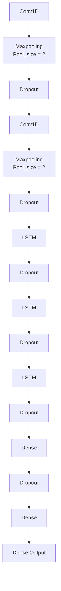

# Deteksi BISINDO dengan CNN+LSTM

Repositori ini merupakan bagian dari Proyek Matakuliah Kecerdesan Buatan Tahun 2026 Fakultas Teknik Program Studi Teknik Komputer Universitas Indonesia. Proyek ini dimaksudkan sebagai pengganti UAS Semester Genap 2026. Pengerjakan proyek ini dilakukan oleh kelompok/grup Rabu-4 yang beranggotakan: 

```
- Muhamad Rey Kafaka Fadlan  (2306250573) 
- Raddief Ezra Satrio Andaru (2306250693) 
- Muhammad Rafli             (2306250730) 
- Izzan Nawa Syarif          (2306266956)   
```
## Latar Belakang
Masyarakat Indonesia yang memiliki disabilitas tunarungu dan tunawicara banyak yang menggunakan bahasa isyarat. Bahasa isyarat yang sering digunakan adalah BISINDO (Bahasa Isyarat Indonesia) yang berasal dan berkembang pada komunitas tunarungu dan tunawicara. BISINDO yang berkembang pada komunitas tunarungu dan tunawicara ini menjadi bahasa sehari-hari mereka namun, bagi yang bukan pengguna BISINDO seperti non-disabilitas maka akan sulit untuk memahami arti dari kata-kata dalam BISINDO sehingga terjadi keterbatasan komunikasi. Keterbatasan komunikasi ini menyebabkan lingkungan masyarakat biasa menjadi tidak inklusif kepada penyandang disabilitas tunarungu dan tunawicara. 

Proyek ini bertujuan untuk menyelesaikan masalah inklusifitas bagi penyandang disabilitas tunarungu dan tuna wicara. Untuk menyelesaikan masalh tersebut kami membuat sebuah AI yang berbasis CNN+LSTM untuk mendeteksi kata-kata dalam BISINDO.

## Dataset
Dataset dalam proyek ini kami buat dengan merekam sebuah video berisi kata-kata dalam BISINDO dengan format .mp4 menggunakan opencv. 
Spesifikasi Dataset:
- 30 FPS
- durasi 3 detik (total frame 90)
- Resolusi $640 \times 480$
- 10 kata dalam BISINDO
- 60 Video per-kata
- Total Video 600 file

`*Perhatian !! : Kami bukan penguna BISINDO yang lancar, kesalahan penuturan gestur/gerakan di dataset dapat terjadi tanpa kami sadari.`

## Pre-Processing
- Hand landmarking pada dataset untuk menjadi sebuah file numpy array untuk setiap video agar dapat diprocess di kode.

- Augmentasi pada dataset untuk mensimulasikan noise dan memperbanyak data dari 600 menjadi 3600.

- Split 60:20:20 pada dataset, 60% untuk Tarin, 20% untuk dev, 20% untuk Test.

## Arsitektur
Arsitektur model yang kami buat menggunakan CNN sebagai layer untuk mengambil data spasial pada sebuah frame. Lalu layer LSTM akan mengambil data Temporal pada kumpulan frame. LSTM dipilih karena dapat mempertimbangkan data dari frame sebelumnya sehingga cocok untuk implementasi pada Deteksi BISINDO yang memiliki banyak gestur dan perlu mempertimbangkan gerakan secara keseluruhan dan bukan hanya dari sebuah 1 data spasial saja.

Arsitektur yang kami gunakan :

